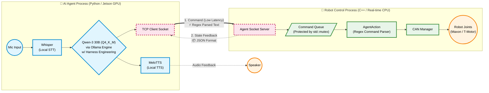

# 🥁 Phil Robot: AI-Powered Humanoid Drummer
> **Jetson AGX Orin 기반의 로컬 AI 에이전트와 실시간 C++ 모터 제어 시스템의 통합 아키텍처**


*(https://www.youtube.com/watch?v=SHXWN2f2ou8)*

---

(./phil_intheloop/artifacts/Simulation_intheloop.png)
(./phil_intheloop/artifacts/SIL2.png)
./phil_intheloop/sil/pybullet_backend.py에서 시뮬레이터에 적용된 관절 매핑과 제어 로직을 보여주는 스크린샷입니다.


## 📖 Project Overview
**Phil Robot**은 KIST에서 개발한 휴머노이드 드럼 로봇 '필(Phil)'에게 AI 기반의 인지/대화 능력을 부여하는 프로젝트입니다. 
외부 API에 전혀 사용하지 않고, 엣지 디바이스(Jetson AGX Orin) 내에서 독립적으로 구동되는 **On-Device AI 파이프라인(Whisper ↔ Qwen 30B ↔ MeloTTS)** 과 실시간성이 요구되는 **C++ 하드웨어 제어 시스템(CAN 통신)** 으로 이루어진 Heterogeneous 시스템을 **TCP 소켓 통신** 으로 통합했습니다.

## 🏗️ System Architecture
Python(AI Brain)과 C++(Robot Body)을 분리하여, AI 연산이 실시간 모터 제어 루프를 방해하지 않도록 비동기 IPC 구조를 채택했습니다.



---

## 📂 1. Directory Structure (핵심 모듈 구조)

불필요한 데이터 로그 및 외부 의존성(SDK, 3rd party)을 제외한 프로젝트의 핵심 폴더 및 파일 구조입니다. 크게 **C++ Body(`DrumRobot2`)** 와 **Python Brain(`phil_robot`)** 으로 나뉘어 있습니다.

```text
📦 ROBOT_PROJECT
├── 📂 DrumRobot2                   # 🦾 [C++ Body] 실시간 로봇 모터 제어 및 소켓 서버
│   ├── 📂 include                  # 모터, 매니저, 시스템 상태 관리를 위한 헤더 파일
│   ├── 📂 src                      # C++ 핵심 동작 소스 코드
│   │   ├── main.cpp                # 프로그램 엔트리 포인트 및 멀티스레드 스폰
│   │   ├── DrumRobot.cpp           # 로봇 라이프사이클 및 상태 머신(State Machine) 관리
│   │   ├── AgentSocket.cpp         # [IPC] Python AI와 통신하는 TCP 소켓 서버
│   │   ├── AgentAction.cpp         # [Parsing] 수신된 [CMD] 정규식 파싱 및 물리적 모션 매핑
│   │   ├── CanManager.cpp          # 로봇 관절 모터(Maxon/T-Motor) CAN 통신 제어
│   │   └── PathManager.cpp         # IK/FK 기반 역운동학 및 드럼 타격 궤적(Path) 생성
│   ├── 📂 magenta                  # [AI Music] Google Magenta 기반 MIDI 패턴 생성 및 처리
│   ├── 📜 Makefile                 # ARM cpu 환경 최적화 빌드 스크립트
│   └── 📂 scripts                  # CAN 네트워크 초기화(ipup/down) 쉘 스크립트
│
├── 📂 phil_robot                   # 🧠 [Python Brain] On-Device AI 에이전트 (클라이언트)
│   ├── 🐍 phil_brain.py            # AI 메인 파이프라인 (STT 입력 ↔ LLM 추론 ↔ TTS 출력)
│   ├── 🐍 phil_client.py           # [IPC] C++ 소켓 서버로 제어 명령 전송 및 상태 피드백 수신
│   ├── 🐍 response_parser.py       # LLM 출력에서 자연어 대화와 제어 커맨드(Harness) 분리
│   ├── 🐍 melo_engine.py           # 로컬 VRAM을 활용한 MeloTTS 기반 음성 합성 모듈
│   ├── 📜 init_phil.sh             # AI 파이프라인 초기화 및 모델 Warm-up 실행 스크립트
│   └── 📂 MeloTTS                  # 로컬 TTS 엔진 서브모듈
│
├── 📂 docs                         # 각종 에셋 보관
└── 📜 README.md
```
---

## ✨ 2. Key Technical Highlights (핵심 엔지니어링)

### 1️⃣ Harness Engineering 기반의 비결정적 출력 제어
LLM의 자유로운 자연어 출력을 C++ 제어부가 정확하게 파싱할 수 있도록, 시스템 프롬프팅을 통해 모든 제어 명령을 표준화된 프로토콜로 강제(Harness)했습니다.
* **통신 포맷:** `[CMD:action:params] >> speech text`

### 2️⃣ State-Aware Context Injection (상태 인식형 프롬프팅)
LLM이 로봇의 현재 물리적 상태를 인지하고 맥락에 맞는 대답을 하도록 설계했습니다.
* **Playing (연주 중):** 사용자의 무리한 요구나 추가 동작 지시를 정중히 거절합니다.
* **Error (에러 상태):** 물리적 한계나 오류 상황(예: 관절 각도 초과, 충돌 위험)에 대해 사과 및 상황 설명을 진행합니다.

### 3️⃣ Model Warm-up & Latency 최적화
GPU Stalling(병목 현상)을 방지하기 위해, 파이프라인 초기화 시 더미(Dummy) 데이터를 주입하여 VRAM에 모델을 미리 상주(Pre-loading)시킵니다.
* **Whisper:** 첫 전사(Transcription) 전에 1초(16,000 samples) 분량의 Zero-padded 오디오를 주입합니다.
* **MeloTTS:** 시작 시 빈 텍스트로 `.speak()`를 호출하여 초기 음성 합성의 지연시간(Latency Spike)을 완벽히 제거했습니다.

### 4️⃣ 비대칭(Asymmetric) IPC 프로토콜 최적화 & 동시성 제어
* **비대칭 통신:** AI에서 로봇으로 가는 명령 전송은 초경량 정규식 기반 텍스트로 레이턴시를 최소화하고, 로봇에서 AI로 오는 상태 피드백은 `JSON` 포맷으로 확장성을 확보했습니다.
* **동시성 제어:** C++ `std::mutex`를 활용해 Command Queue의 데이터 레이스(Data Race)를 원천 차단하여 모터의 지터링(Jittering)을 방지했습니다.

---

## 🚀 3. Build & Run (실행 방법)

> ⚠️ **필수 주의사항 (Connection Order)**
> TCP 연결 구조상, **C++(Server)** 가 먼저 실행되어 대기 상태(`'o'` 키 입력 입력 대기)가 된 후 **Python(Client)** 을 실행해야 합니다.
 
### Step 1. C++ Backend (DrumRobot Body)
루트 디렉토리에서 프로젝트를 빌드하고 서버를 실행합니다.
```bash
cd DrumRobot2
make clean
make
./bin/main.out
```
1. 프로그램이 켜지면 터미널에서 소켓이 연결되며 모터 초기화를 진행합니다.
2. 로봇의 **물리적 안전 키(Lock Key)** 를 뽑습니다.
3. 키를 제거한 후 'k'를 누르고 대기 상태(0: Idle/Ready)로 진입합니다.

### Step 2. Python AI Brain (Client)
새로운 터미널 창을 열고 AI 파이프라인을 실행합니다.
```bash
conda activate drum4
cd phil_robot
./init_phil.sh
python phil_robot/phil_brain.py
```
1. TTS 엔진과 STT 모델이 VRAM에 로딩(Warm-up)됩니다.

2. 콘솔에 [Listening...]이 뜨면 마이크에 대고 자연스럽게 명령합니다.
(예: "필봇,안녕!" 또는 "This Is Me 연주 시작하자.")
---
**💡 이 프로젝트의 세부 아키텍처와 자세한 설명은 .github/copilot-instructions.md에 상세히 기록되어 있습니다.**
