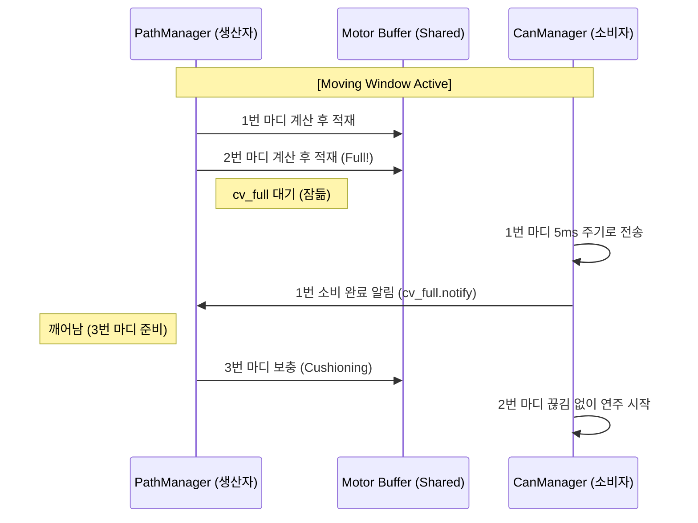

# [분석 보고서] 이전 vs 이후: 무빙 윈도우와 동기화 구조의 진화

본 문서는 `DrumRobot2`의 궤적 생성 방식이 기존의 비동기 무빙 윈도우에서 어떻게 실시간 동기화 구조로 발전했는지 분석합니다.

---

## 1. 무빙 윈도우(Moving Window)의 실체 확인

*   **기존 방식**: 악보 파일 전체를 한꺼번에 읽는 것이 아니라, `readMeasure`를 통해 라인 단위로 읽고 `preCreatedLine (3)` 만큼의 버퍼를 유지하며 IK를 푸는 **무빙 윈도우 방식이 이미 적용되어 있었습니다.**
*   **오해의 소지**: 하지만 동기화 로직이 없었기 때문에, 생산자(`PathManager`)가 실제 연주 속도보다 훨씬 빠르게 곡 끝까지 계산을 마쳐버리는 현상이 발생했습니다. 이로 인해 사용자는 시스템이 "한꺼번에 다 계산하고 시작하는 것"처럼 느끼게 되었습니다.

---

## 2. 구조적 변화 비교

### [이전] 비동기 무빙 윈도우 (Unsynchronized)
*   **특징**: `PathManager`가 `CanManager`의 소비 속도와 상관없이 독립적으로 동작.
*   **결과**: 모터의 `commandBuffer`에 수천~수만 개의 데이터가 순식간에 쌓임.
*   **문제**: 정지 명령 시 이미 쌓인 데이터를 제어할 수 없어 버퍼를 강제로 비우고 급정거해야 함.

### [이후] 동기화된 무빙 윈도우 (Synchronized Bounded Buffer)
*   **특징**: 조건 변수(`cv_full`, `cv_empty`)를 사용하여 생산자와 소비자의 속도를 일치시킴.
*   **결과**: `commandBuffer`에는 항상 **최대 2마디** 분량의 데이터만 유지됨.
*   **이점**: 
    - **반응성**: 정지 명령 즉시 다음 마디에 '감속 궤적' 주입 가능.
    - **부드러움**: "퉁..퉁..퉁..퉁" 하며 서서히 멈추는 인간형 마무리 구현.
    - **마킹**: 멈춘 지점(`play_file_index`)을 정확히 알고 재개 시 `READY` 자세 복귀 후 부드럽게 이어감.

---

## 3. 생산자-소비자 동기화 다이어그램

---

## 4. 개선 효과 요약

1.  **제어 지연 최소화**: 궤적 수정(Tempo, Stop 등)이 최대 1~2마디 내에 하드웨어에 반영됩니다.
2.  **안정적인 재개**: 정지 지점을 마킹하고 `initPlayStateValue`를 통해 상태를 동기화하여 재개 시 튕김 현상을 방지합니다.
3.  **예술적 완성도**: 인터럽트 방식의 급정거에서 탈피하여, 연주자가 힘을 빼며 마무리하는 듯한 자연스러운 종료가 가능해졌습니다.
