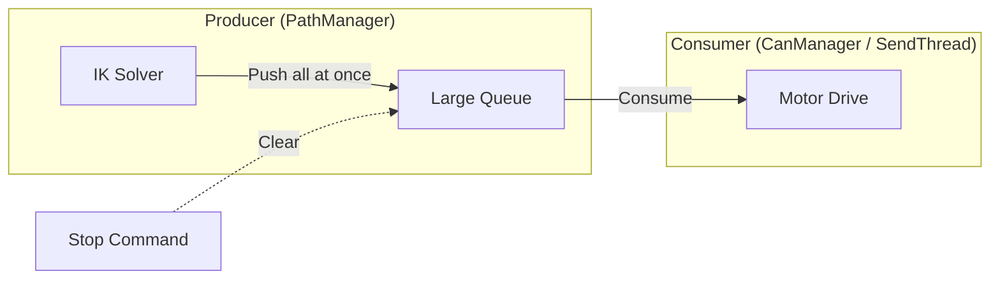
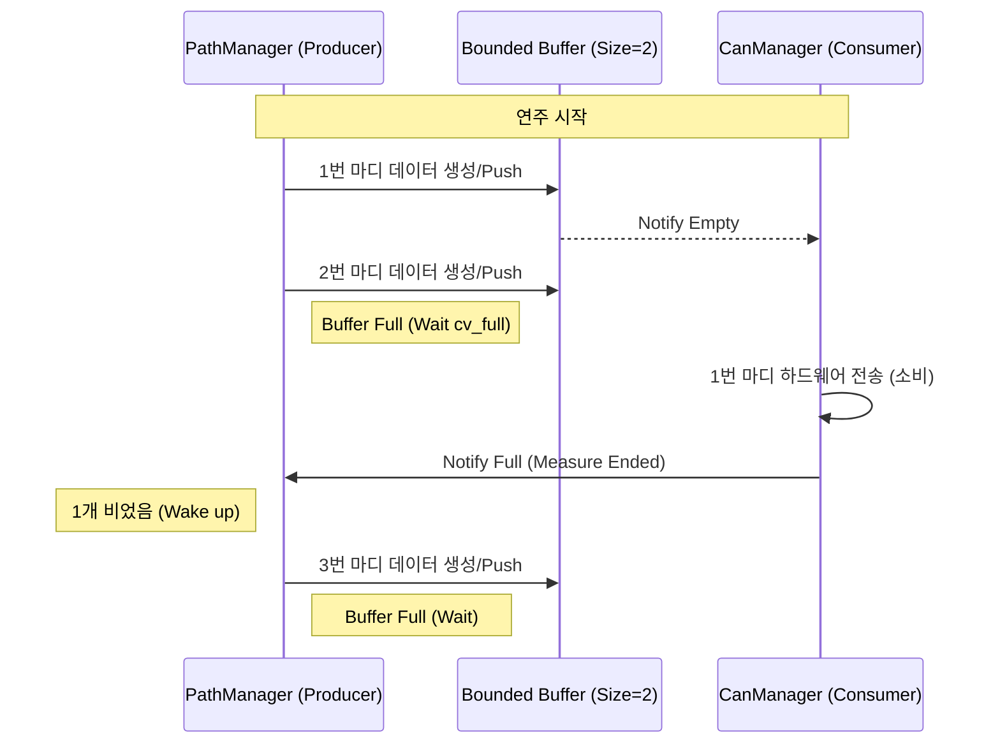

# 로봇 제어 시스템 개선 보고서: 동기화 구조 및 Graceful Stop 도입

본 문서는 `DrumRobot2` 시스템의 궤적 생성 및 명령 전송 로직이 기존의 비동기 방식에서 **생산자-소비자(Producer-Consumer) 모델** 기반의 동기화 구조로 변경된 내용과, **자연스러운 정지(Graceful Stop)** 및 **재개(Resume)** 기능 도입에 대해 상세히 설명합니다.

---

## 1. 핵심 변경 사항 요약

| 항목 | 기존 (Asynchronous) | 변경 후 (Synchronous / P-C Model) |
| :--- | :--- | :--- |
| **버퍼 구조** | 제한 없는 대용량 큐 (Full Buffering) | 크기 2의 유한 버퍼 (Bounded Buffer, size=2) |
| **동기화 방식** | 비동기식 (생산자가 끝까지 밀어넣음) | 조건 변수(`Condition Variable`)를 이용한 상호 대기 |
| **정지 방식** | 즉시 중단 및 버퍼 초기화 (Abrupt Stop) | 현재 마디 완료 후 부드러운 감속 정지 (Graceful Stop) |
| **재개 방식** | 정지 지점 고려 부족 | 정지 지점 마킹 및 READY 자세 복귀 후 부드러운 재개 |
| **기대 효과** | 빠른 처리 속도 (하지만 실시간성 저하 가능) | 실시간 동기화 보장, 안정적인 정지/재개, 메모리 효율성 |

---

## 2. 생산자-소비자(Producer-Consumer) 다이어그램

### [이전] 비동기 구조 (Asynchronous Queuing)
생산자가 하드웨어 소비 속도와 상관없이 모든 궤적을 미리 계산하여 큐에 쌓아두는 구조입니다.

### [이후] 동기화 구조 (Synchronous Bounded Buffer)
버퍼 크기를 2로 제한하고, 생산자와 소비자가 서로의 상태에 따라 대기(`Wait`) 및 알림(`Notify`)을 주고받습니다.

---

## 3. 클래스별 변경 상세

### 1) `PathManager` (생산자 역할)
- **변경점**: `measure_mutex`, `cv_full`, `cv_empty`, `measure_count` 도입.
- **로직**: 
    - `solveIKandPushCommand` 실행 시 `measure_count`가 2 이상이면 `cv_full`에서 대기합니다.
    - 한 마디 생성이 완료되면 `measure_count`를 올리고 소비자에게 알립니다 (`cv_empty.notify_one`).
    - `is_graceful_stopping` 플래그를 확인하여 마지막 데이터에 종료 마커를 삽입합니다.
- **효과**: 계산 성능이 하드웨어 전송 속도를 앞질러 "미래의 명령"이 과도하게 쌓이는 것을 방지합니다.

### 2) `CanManager` (소비자 역할)
- **변경점**: `setCANFrame` 내부에서 `cv_empty` 대기 로직 및 마디 종료 감지 로직 추가.
- **로직**:
    - 소비할 데이터가 없으면 `cv_empty`에서 대기합니다.
    - 모터 데이터 구조체(`TMotorData`, `MaxonData`)에 포함된 `is_measure_end` 플래그를 확인합니다.
    - 마디가 완전히 소비되면 `measure_count`를 줄이고 생산자에게 알립니다 (`cv_full.notify_one`).
- **효과**: 하드웨어 전송 주기(1ms/5ms)와 궤적 생성 주기를 완벽하게 동기화합니다.

### 3) `Motor` (데이터 캐리어)
- **변경점**: `TMotorData`, `MaxonData` 구조체에 `is_measure_end`, `is_last_measure` 필드 추가.
- **효과**: 단순한 위치/속도 값 외에 "제어 메타 데이터"를 함께 전달하여 동기화 및 종료 시점을 정확히 파악하게 합니다.

### 4) `DrumRobot` (시스템 관리자)
- **변경점**: "stop" 명령 처리 로직 변경 및 `Resume` 전처리기 추가.
- **로직**:
    - `stop` 시 버퍼를 즉시 비우지 않고 `is_graceful_stopping`만 활성화합니다.
    - `runPlayProcess` 재개 시, `READY` 자세로 부드럽게 복귀하는 `runAddStanceProcess`를 먼저 수행하여 급격한 관절 이동을 방지합니다.
- **효과**: 사용자 경험 측면에서 로봇이 "급정거"하지 않고 "마무리 동작 후 정지"하는 안정감을 제공합니다.

---

## 4. Graceful Stop & Resume 시퀀스

1. **User**: `stop` 명령 입력.
2. **DrumRobot**: `PathManager::is_graceful_stopping = true` 설정.
3. **PathManager**: 현재 생성 중인 마디의 마지막 점에 `is_last_measure = true`를 마킹하고 데이터 생성 루프 종료.
4. **CanManager**: 큐에 남은 데이터를 모두 소비하다가 `is_last_measure`를 만나면 전송을 멈추고 `Main::Ideal` 상태로 전환.
5. **Resume 시**: 
    - `initPlayStateValue()`를 통해 이전의 타겟 값을 현재 위치와 동기화.
    - `READY` 자세로 부드럽게 이동하여 연주 준비 완료.
    - 다음 인덱스부터 연주 재개.

---

이러한 구조적 변화를 통해 `DrumRobot2`는 보다 정교한 실시간 제어가 가능해졌으며, 예상치 못한 상황에서의 정지 및 재개 시에도 하드웨어 손상을 방지하고 부드러운 동작을 보장할 수 있게 되었습니다.
