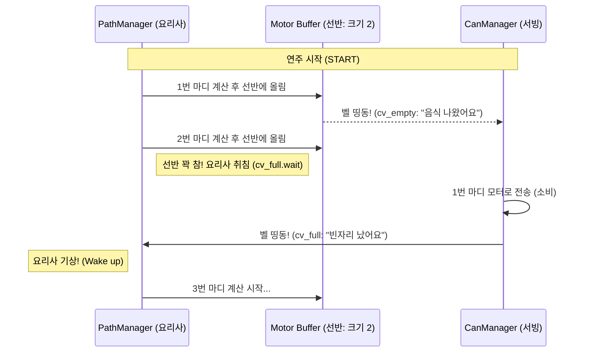

# [개선 보고서] 로봇 제어 시스템: 공유 자원 동기화 및 Graceful Stop 도입

본 문서는 `DrumRobot2` 시스템의 핵심 로직이 **단순한 데이터 보호** 수준을 넘어, **생산자-소비자 간의 흐름 동기화** 구조로 진화한 과정을 상세히 설명합니다.

---

## 1. 공유 자원(Shared Resource)과 임계 구역(Critical Section)

기존 `Motor` 객체 내부의 `commandBuffer`(명령 큐)는 여러 스레드가 접근하는 **공유 자원**이었습니다.

*   **임계 구역(Critical Section)**: `PathManager`가 데이터를 넣을 때와 `CanManager`가 데이터를 뺄 때 접근하는 코드 영역.
*   **기존 방식 (Mutex Lock)**: 화장실 문을 잠그듯 `mutex`를 사용하여 데이터가 꼬이지 않게 보호만 했습니다. 하지만 생산자가 너무 빠르면 화장실(버퍼)에 사람이 무한정 줄을 서는(메모리 폭발) 문제가 있었습니다.
*   **개선 방식 (Synchronization)**: 단순히 문을 잠그는 것을 넘어, 자리가 없으면 밖에서 대기하고 자리가 나면 호출벨을 눌러주는 **동기화 로직**을 추가했습니다.

---

## 2. 핵심 기술: 조건 변수(Condition Variable, `cv`)

`cv`는 스레드 간의 **"호출벨"**입니다. 데이터를 담는 바구니가 아니라, **"지금 움직여도 돼!"**라고 알려주는 신호등 역할을 합니다.

### 💡 쉽게 이해하는 비유: "로봇 주방 (식당)"
*   **요리사 (`PathManager`)**: 로봇이 움직일 경로(IK)를 계산해서 접시(데이터)를 만듭니다.
*   **서빙 직원 (`CanManager`)**: 접시를 들고 가서 실제 모터에 전달합니다.
*   **공유 선반 (`Motor Buffer`)**: 요리사가 접시를 올려두고 서빙 직원이 가져가는 **공유 자원**. (최대 2접시만 가능)
*   **호출벨 (`cv`)**: 
    *   **`cv_full`**: 선반이 꽉 차면 요리사가 주방 구석에서 잠듭니다. 서빙 직원이 접시를 치우면 벨을 눌러 요리사를 깨웁니다.
    *   **`cv_empty`**: 선반이 비면 서빙 직원이 대기실에서 잠듭니다. 요리사가 새 접시를 올리면 벨을 눌러 직원을 깨웁니다.

---

## 3. 시스템 구조 다이어그램

### [이후] 생산자-소비자 동기화 모델 (Bounded Buffer)

---

## 4. Graceful Stop (자연스러운 정지) 및 Resume (재개)

기존에는 정지 명령이 들어오면 모든 접시(데이터)를 버리고 그 자리에 멈췄습니다. 현재는 다음과 같이 변경되었습니다.

### 1) 마킹 (Marking)
*   정지(`stop`) 명령이 들어오면, 요리사는 지금 만들고 있는 마디의 마지막 접시에 **"이게 마지막이요"**라는 쪽지(`is_last_measure`)를 붙입니다.
*   서빙 직원은 선반에 남은 접시를 마저 서빙하다가, 이 쪽지를 발견하면 그제야 서빙을 멈추고 퇴근합니다.

### 2) 부드러운 재개 (Smooth Resume)
*   로봇이 멈춘 지점이 어정쩡할 수 있습니다. 
*   다시 연주할 때는 바로 시작하지 않고, **`READY` 자세로 부드럽게 이동**하는 과정을 먼저 거칩니다.
*   이후 저장해두었던 파일 인덱스(`play_file_index`)부터 다시 연주를 이어갑니다.

---

## 5. 기대 효과 (What we expect)

1.  **실시간성 보장**: 계산이 너무 앞서가서 발생하는 지연 시간(Latency)이 사라집니다. (항상 최신 2마디만 유지)
2.  **하드웨어 보호**: 급정거로 인한 모터의 충격과 튕김 현상을 방지합니다.
3.  **안정적인 운용**: 정지 후 재개 시 로봇이 갑자기 튀지 않고 부드럽게 준비 동작을 취하므로 사용자(engineer)와 관객 모두에게 안정감을 줍니다.
