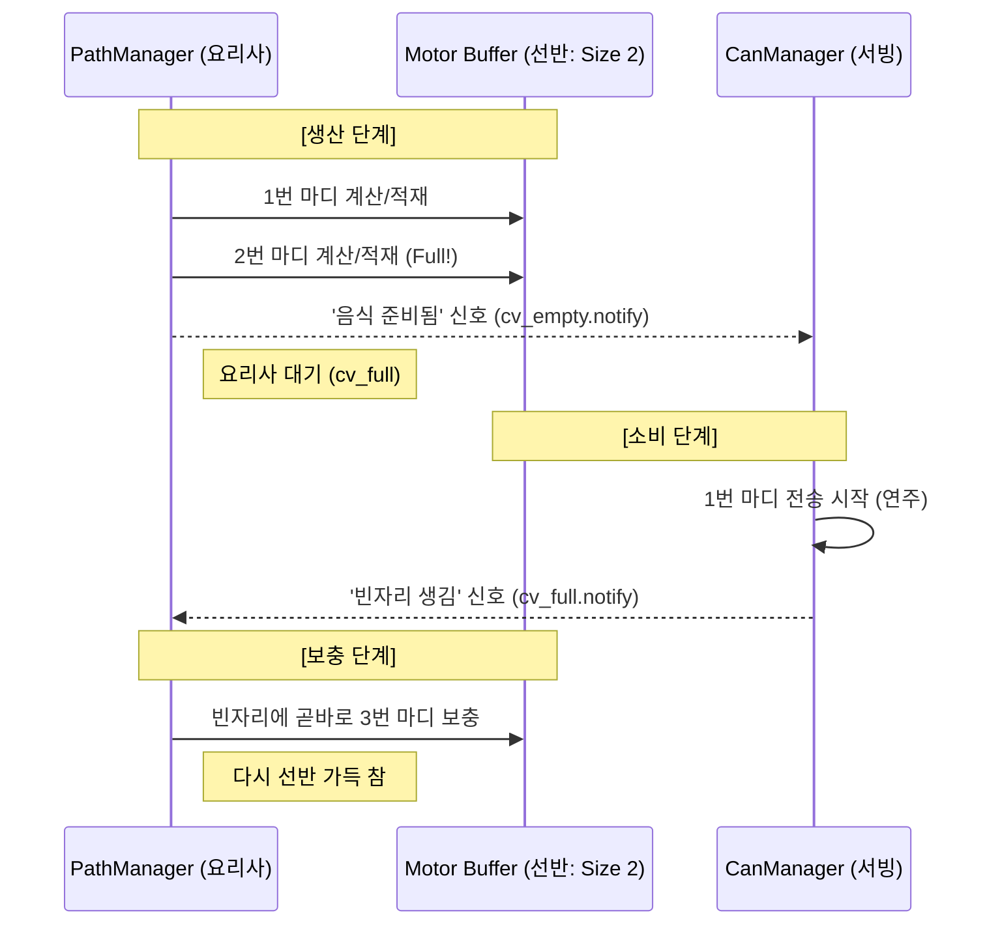

# [개선 보고서 v4] 생산자-소비자 동기화 및 '인간형 마무리' 로직 상세

본 문서는 `DrumRobot2`의 동기화 구조를 **사용자의 설계 의도(2-마디 Bounded Buffer)**에 맞춰 명확히 재정리한 보고서입니다.

---

## 1. 명칭 정의: 기다림(Wait) vs 알림(Signal)

코드 내 변수명과 실제 동작하는 신호의 의미를 사용자 직관에 맞춰 매핑합니다.

*   **생산자 알림 (`cv_empty.notify`)**: "선반에 음식이 준비됨(Full)"을 소비자에게 알리는 신호.
*   **소비자 알림 (`cv_full.notify`)**: "선반에 빈자리가 생김(Empty)"을 생산자에게 알리는 신호.
*   **동기화의 핵심**: 요리사는 선반이 가득 차면 쉬고, 서빙 직원은 선반이 비면 쉽니다. 이 '쉬는 상태'를 깨우는 것이 각자의 알림(Signal)입니다.

---

## 2. 생산자-소비자 동기화 다이어그램 (Full-Start 모델)

사용자가 의도한 **"2마디가 확보되어야 전송을 시작하고, 하나가 비면 즉시 채우는"** 구조입니다.

---

## 3. '인간형 마무리(Graceful Stop)'와의 연계

이 동기화 구조가 왜 **"퉁..퉁..퉁..퉁"** 하는 부드러운 정지를 가능하게 하는가?

1.  **실시간성**: 선반에 접시가 딱 2개뿐이므로, `stop` 명령 시점에 만들어지는 "느려지는 궤적"이 아주 빠르게(최대 1~2마디 내) 로봇에게 전달됩니다.
2.  **연속성**: 인터럽트로 끊지 않고, 마지막 접시에 담긴 "감속 궤적"을 모터가 끝까지 수행함으로써 연주자가 힘을 빼며 마무리하는 느낌을 완벽히 재현합니다.
3.  **마킹**: 마지막 마디 데이터에 `is_last_measure` 플래그를 심어, 서빙 직원이 "이번이 마지막 접시구나"를 알고 자연스럽게 정지 상태로 전환하게 합니다.

---

## 4. 결론

이번 개선을 통해 `DrumRobot2`는 단순한 기계적 동작을 넘어, **생산(계산)-소비(전송)-제어(마무리)**가 유기적으로 연결된 시스템이 되었습니다. 특히 버퍼 크기를 2로 제한한 것은 반응성과 안정성 사이의 최적의 균형점이며, 이를 통해 사용자(pioneer)님이 의도하신 섬세한 드럼 연주 마무리가 가능해졌습니다.
