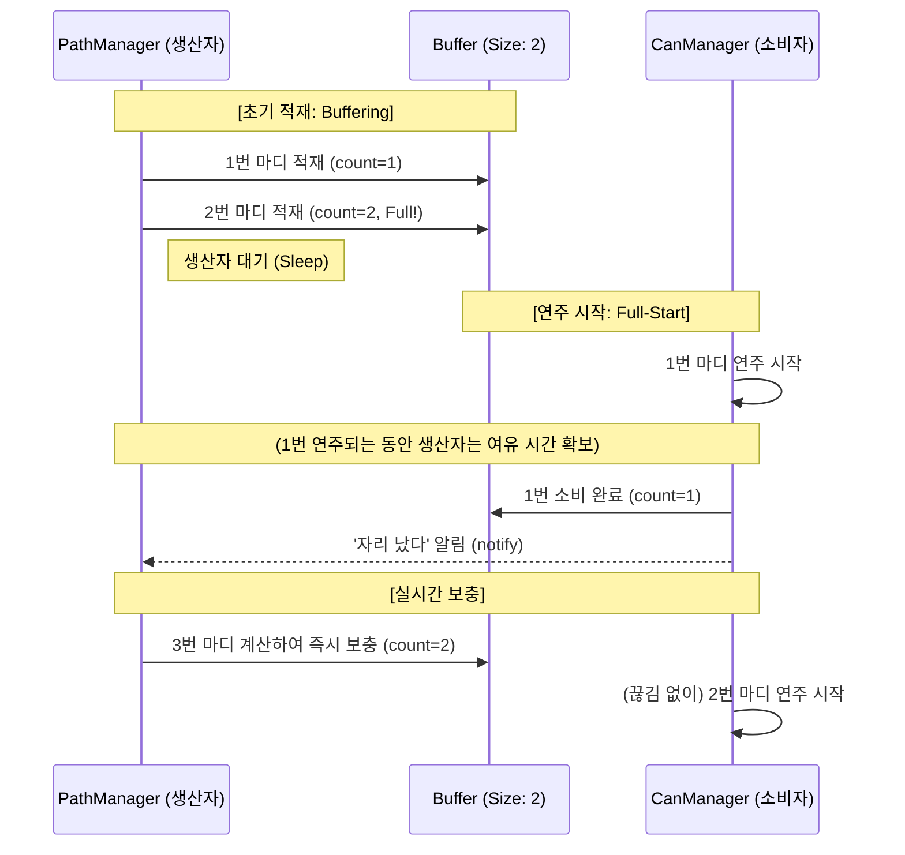

# [최종 보고서 v5] Full-Start 동기화 및 인간형 마무리 시스템

본 문서는 `DrumRobot2`의 연주 안정성을 극대화하기 위한 **2마디 완충(Buffering)** 로직과 **자연스러운 감속 정지** 시스템의 최종 구현 내용을 담고 있습니다.

---

## 1. 핵심 로직: Full-Start & Continuous Cushioning

단순히 데이터가 생기자마자 보내는 것이 아니라, **안전 자산(데이터)을 먼저 확보**하고 연주를 시작하는 구조입니다.

### 💡 왜 2개를 먼저 채우는가? (시차의 마법)
*   **첫 박 지연 방지**: 연주 시작 직전에 이미 2마디 분량의 계산을 끝내놓으므로, 첫 박이 계산 속도 때문에 밀리는 현상을 원천 차단합니다.
*   **연주 중 중단 방지 (Cushioning)**: 
    1. 선반에 1번, 2번 마디가 꽉 차면 연주를 시작합니다.
    2. 1번 마디가 연주되는 동안, 생산자는 **이미 2번이 대기 중이므로 여유 있게 3번을 계산**할 수 있는 시간을 벌게 됩니다.
    3. 1번이 끝나면 2번이 즉시 실행되고, 그 사이 생산자는 3번을 선반에 채워 넣습니다.
*   **결과**: 연주 중에는 항상 **'다음에 연주할 마디'가 이미 준비되어 있는 상태**를 유지하여 절대 끊기지 않는 무대를 만듭니다.

---

## 2. 생산자-소비자 동기화 다이어그램 (최종본)

---

## 3. 인간형 마무리 (Graceful Stop)와 시너지는?

이 '2마디 완충' 구조는 정지 시에도 빛을 발합니다.

1.  **실시간 정지 반영**: 버퍼가 딱 2개뿐이므로, `stop` 명령 시점에 만들어지는 "느려지는 궤적"이 아주 빠르게(최대 1~2마디 내) 로봇에게 전달됩니다.
2.  **예술적 페이드 아웃**: 인터럽트로 딱 끊지 않고, 마지막에 담긴 감속 궤적을 끝까지 수행하여 **"퉁..퉁..퉁.... 퉁"** 하는 연주자의 여운 있는 마무리를 재현합니다.

---

## 4. 최종 결론

`DrumRobot2`는 이제 **"미리 생각하고(2마디 예독), 여유롭게 움직이는(완충 연주)"** 똑똑한 시스템이 되었습니다. 이 구조는 하드웨어의 물리적 한계와 소프트웨어의 계산 부하 사이에서 가장 인간적이고 안정적인 연주를 가능하게 하는 최적의 설계입니다.
