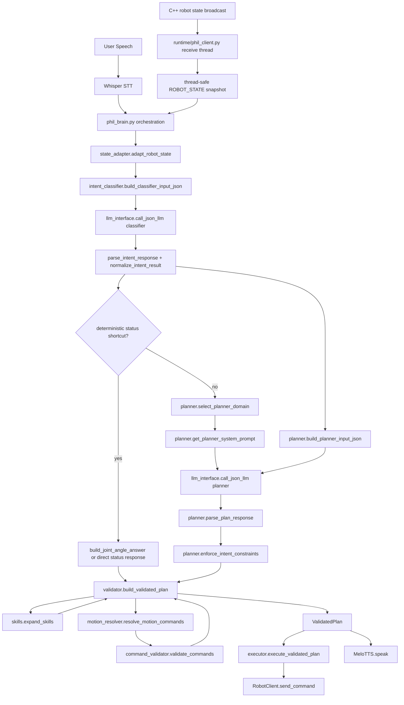

# Phil Robot LLM Pipeline Architecture

## Overview

This document summarizes the current Python-side control architecture for `phil_robot`.
The original voice loop was a monolithic:

```text
STT -> one LLM call -> parse -> send_command -> TTS
```

The current implementation is a staged pipeline with explicit contracts, domain routing,
state adaptation, validation, and execution boundaries.

Current top-level stages:

1. `STT`
2. `Runtime State Snapshot`
3. `State Adaptation`
4. `Intent Classification`
5. `Deterministic Status Shortcut`
6. `Domain-Specific Planning`
7. `Skill Expansion`
8. `Relative Motion Resolution`
9. `Command Validation`
10. `Plan Validation`
11. `Execution`
12. `TTS`
13. `State Feedback`

## What Changed Compared to the Original Loop

### Original Architecture

```text
Whisper STT
  -> one general-purpose LLM
  -> regex / string parser
  -> send_command(...)
  -> TTS
```

### Current Architecture

```text
Whisper STT
  -> state_adapter
  -> classifier LLM
  -> planner-domain router
  -> planner LLM
  -> planner JSON parse
  -> skill expansion
  -> relative motion resolver
  -> command validator
  -> ValidatedPlan
  -> executor
  -> TTS
  -> robot state feedback
```

### Major Engineering Improvements

- JSON-only LLM outputs instead of free-form command strings
- explicit classifier/planner split
- domain-specific planner routing
- skill-first planning
- plan-level validation object (`ValidatedPlan`)
- deterministic handling for selected status queries
- low-level runtime state separated from LLM-facing summaries
- runtime safety no longer delegated purely to prompts
- reduced parser fragility
- clearer debugging and future replay/evaluation insertion points

## Current Capabilities

### Interaction Capabilities

- Korean speech input via Whisper STT
- Korean speech output via MeloTTS
- two-stage LLM inference
  - stage 1: intent classifier
  - stage 2: planner
- domain-specific planning
  - `chat`
  - `motion`
  - `play`
  - `status`
  - `stop`
  - `generic`
- safety-aware rejection messaging
- state-aware explanatory responses
- deterministic direct answers for selected status questions
  - robot identity questions
  - joint-angle questions such as `왼쪽 손목 몇 도야`

### Control Capabilities

- direct low-level command support:
  - `r`
  - `h`
  - `s`
  - `p:<song_code>`
  - `look:pan,tilt`
  - `gesture:<name>`
  - `move:<motor>,<angle>`
  - `wait:<seconds>`
- relative motion interpretation:
  - `올려봐`
  - `내려봐`
  - `50도 더 올려`
  - `거기서 50도 더 올리고 2초 있다`
- joint range blocking
- robot-state-based blocking:
  - safety lock
  - play state
  - error state
  - busy / non-fixed state
- sequence warning generation

### Skill-First Planning Capabilities

Planner output can contain high-level skills instead of only low-level commands.

Current built-in skills:

- `wave_hi`
- `nod_yes`
- `shake_no`
- `happy_react`
- `celebrate`
- `look_forward`
- `look_left`
- `look_right`
- `look_up`
- `look_down`
- `ready_pose`
- `idle_home`
- `play_tim`
- `play_ty_short`
- `play_bi`
- `play_test_one`
- `shutdown_system`

Each skill includes:

- `category`
- `description`
- deterministic low-level `commands`

This makes planner output more reproducible and easier to validate.

## Python LLM Architecture Diagram

### ASCII Diagram

```text
┌──────────────────────────────┐
│          User Speech         │
└──────────────┬───────────────┘
               │
               v
┌──────────────────────────────┐
│         Whisper STT          │
└──────────────┬───────────────┘
               │ user_text
               v
┌──────────────────────────────┐
│        phil_brain.py         │
│      orchestration layer     │
└──────────────┬───────────────┘
               │ raw_robot_state snapshot
               v
┌──────────────────────────────┐
│       state_adapter.py       │
│  adapt_robot_state()         │
│  build_*_state_summary()     │
└───────┬──────────────┬───────┘
        │              │
        │              └──────────────┐
        │                             │
        v                             v
┌──────────────────────┐    ┌──────────────────────────┐
│ full adapted state   │    │ classifier state summary │
└──────────┬───────────┘    └──────────────┬───────────┘
           │                               │
           │                               v
           │                  ┌──────────────────────────┐
           │                  │   intent_classifier.py   │
           │                  └──────────────┬───────────┘
           │                                 │
           │                                 v
           │                  ┌──────────────────────────┐
           │                  │     llm_interface.py     │
           │                  │     classifier call      │
           │                  └──────────────┬───────────┘
           │                                 │
           │                                 v
           │                  ┌──────────────────────────┐
           │                  │ parse / normalize intent │
           │                  └──────────────┬───────────┘
           │                                 │
           │          deterministic status?  │
           │                  yes ───────────┼───────┐
           │                                 │       │
           │                                 no      v
           │                                 │  ┌──────────────────────┐
           │                                 │  │ direct status reply  │
           │                                 │  └───────────┬──────────┘
           │                                 │              │
           │                                 v              │
           │                  ┌──────────────────────────┐  │
           │                  │       planner.py         │  │
           │                  │ domain router / input JSON │  │
           │                  └──────────────┬───────────┘  │
           │                                 │              │
           │                                 v              │
           │                  ┌──────────────────────────┐  │
           │                  │     llm_interface.py     │  │
           │                  │       planner call       │  │
           │                  └──────────────┬───────────┘  │
           │                                 │              │
           │                                 v              │
           │                  ┌──────────────────────────┐  │
           │                  │ parse plan / constraints │  │
           │                  └──────────────┬───────────┘  │
           │                                 │              │
           │                                 └──────┬───────┘
           │                                        │
           v                                        v
┌──────────────────────────────────────────────────────────┐
│                    validator.py                          │
│        skill expansion + motion resolution +             │
│         command validation + speech finalization         │
└──────────────┬───────────────────────────────┬───────────┘
               │                               │
               v                               v
   ┌──────────────────────┐       ┌─────────────────────────┐
   │      skills.py       │       │  motion_resolver.py     │
   │   expand symbolic    │       │ relative -> absolute    │
   └──────────────────────┘       └─────────────┬───────────┘
                                                │
                                                v
                                   ┌────────────────────────┐
                                   │ command_validator.py   │
                                   │ syntax/range/state     │
                                   └────────────┬───────────┘
                                                │
                                                v
                                   ┌────────────────────────┐
                                   │      ValidatedPlan     │
                                   └────────────┬───────────┘
                                                │
                                                v
                                   ┌────────────────────────┐
                                   │      executor.py       │
                                   └────────────┬───────────┘
                                                │
                                                v
                                   ┌────────────────────────┐
                                   │ RobotClient socket I/O │
                                   └────────────┬───────────┘
                                                │
                                                v
                                   ┌────────────────────────┐
                                   │        MeloTTS         │
                                   └────────────────────────┘

C++ robot state broadcast -> runtime/phil_client.py -> thread-safe ROBOT_STATE -> phil_brain.py
```

### Mermaid Diagram



## Module Responsibilities

### 1. Orchestration Layer

File: [phil_brain.py](/home/shy/robot_project/phil_robot/phil_brain.py)

Responsibilities:

- runtime bootstrap
- STT invocation
- state snapshot acquisition
- pipeline invocation
- validated plan execution
- TTS invocation
- human-readable debug logging

This file is an orchestration entrypoint, not a mixed logic container.

### 2. State Adaptation Layer

File: [state_adapter.py](/home/shy/robot_project/phil_robot/pipeline/state_adapter.py)

Responsibilities:

- normalize raw robot state from C++
- map internal song codes to display labels
- alias `error_message` -> `error_detail`
- preserve full runtime state for low-level Python control logic
- build LLM-facing state summaries
- detect joint-angle status queries
- build deterministic angle answers from the current state snapshot

State is intentionally split into multiple representations.

#### Full Adapted Runtime State

Used by:

- [brain_pipeline.py](/home/shy/robot_project/phil_robot/pipeline/brain_pipeline.py)
- [motion_resolver.py](/home/shy/robot_project/phil_robot/pipeline/motion_resolver.py)
- [command_validator.py](/home/shy/robot_project/phil_robot/pipeline/command_validator.py)
- [validator.py](/home/shy/robot_project/phil_robot/pipeline/validator.py)

Contains:

- `current_angles`
- `last_action`
- full execution context

#### Classifier State Summary

Used by:

- [intent_classifier.py](/home/shy/robot_project/phil_robot/pipeline/intent_classifier.py)

Contains compact decision features only:

- mode/state
- busy/can_move
- current song
- current song label
- last action
- error detail

#### Planner State Summary

Used by:

- [planner.py](/home/shy/robot_project/phil_robot/pipeline/planner.py)

Contains high-level execution state and a current joint snapshot for status explanations:

- state
- busy/can_move
- current song
- current song label
- bpm
- progress
- last action
- error detail
- `current_angles`

### 3. Intent Classification Layer

File: [intent_classifier.py](/home/shy/robot_project/phil_robot/pipeline/intent_classifier.py)

Responsibilities:

- classify user intent
- estimate `needs_motion`
- estimate `needs_dialogue`
- provide a coarse `risk_level`
- apply post-parse normalization for motion-bearing intents
- force angle-question utterances into `status_question`

Output schema:

```json
{
  "intent": "chat | motion_request | play_request | status_question | stop_request | unknown",
  "needs_motion": true,
  "needs_dialogue": true,
  "risk_level": "low | medium | high"
}
```

### 4. LLM Interface Layer

File: [llm_interface.py](/home/shy/robot_project/phil_robot/pipeline/llm_interface.py)

Responsibilities:

- wrap Ollama chat invocation
- enforce JSON output mode
- centralize LLM fallback handling

### 5. Domain-Specific Planning Layer

File: [planner.py](/home/shy/robot_project/phil_robot/pipeline/planner.py)

Responsibilities:

- map `intent` to planner domain
- choose a domain-specific system prompt
- build planner input JSON
- parse planner JSON
- enforce post-plan domain constraints

Current planner domains:

- `chat`
- `motion`
- `play`
- `status`
- `stop`
- `generic`

Planner output schema:

```json
{
  "skills": ["wave_hi"],
  "commands": [],
  "speech": "안녕하세요!",
  "reason": "simple greeting"
}
```

Planner domains reduce prompt interference between unrelated tasks. For example:

- chat planning no longer shares the same main prompt logic as play planning
- status explanation is separated from motion generation
- stop/shutdown planning is isolated from social/motion planning

### 6. Skill Registry Layer

File: [skills.py](/home/shy/robot_project/phil_robot/pipeline/skills.py)

Responsibilities:

- maintain stable high-level behavior macros
- associate skills with categories and descriptions
- expand symbolic actions into deterministic command sequences
- deduplicate consecutive duplicate commands

Skill categories:

- `social`
- `visual`
- `posture`
- `play`
- `system`

### 7. Relative Motion Resolution Layer

File: [motion_resolver.py](/home/shy/robot_project/phil_robot/pipeline/motion_resolver.py)

Responsibilities:

- resolve relative motion language into absolute motor targets
- infer omitted joint context from `last_action`
- block over-limit relative requests before execution
- strip associated `wait` chains when a preceding move is invalid

This is where low-level joint state becomes relevant again.

### 8. Command Validation Layer

File: [command_validator.py](/home/shy/robot_project/phil_robot/pipeline/command_validator.py)

Responsibilities:

- grammar validation
- enum validation
- range validation
- state gating
- legacy normalization
- sequence warning generation

Validated concerns include:

- command syntax
- joint range compliance
- lock-key gating
- play-state gating
- busy-state gating
- coarse sequencing risks

### 9. Plan Validation Layer

File: [validator.py](/home/shy/robot_project/phil_robot/pipeline/validator.py)

Responsibilities:

- expand skills
- resolve relative motions
- validate resulting low-level commands
- merge warnings
- finalize user-facing speech

Execution contract:

```python
ValidatedPlan(
    skills=[...],
    raw_commands=[...],
    expanded_commands=[...],
    resolved_commands=[...],
    valid_commands=[...],
    rejected_commands=[...],
    warnings=[...],
    speech="...",
    reason="..."
)
```

`ValidatedPlan` is the boundary between planning and execution.

### 10. Execution Layer

Files:

- [executor.py](/home/shy/robot_project/phil_robot/pipeline/executor.py)
- [command_executor.py](/home/shy/robot_project/phil_robot/pipeline/command_executor.py)

Responsibilities:

- consume only validated plans
- transmit robot commands over the socket client
- handle `wait:<seconds>` in Python as a temporary delay primitive

### 11. LangGraph State Machine Layer

Files:

- [robot_graph.py](/home/shy/robot_project/phil_robot/pipeline/robot_graph.py)
- [state_graph.py](/home/shy/robot_project/phil_robot/pipeline/state_graph.py)
- [exec_thread.py](/home/shy/robot_project/phil_robot/pipeline/exec_thread.py)

Responsibilities:

- Compose the `process → execute → return_home` node graph
- `InterruptibleExecutor`: Executes robot commands in a background thread, sends `s` (stop) and aborts `wait` upon `cancel()` (synchronized with the C++ incremental execution and buffer flushing)
- Determines whether to return home based on `plan_type` (motion/play/stop/chat)
- Handles Enter key input to instantly interrupt previous actions and process new commands (supports Pause/Resume)
- Synchronizes TTS and robot commands (gesture while speaking)

### 12. Session Layer

Files:

- [session.py](/home/shy/robot_project/phil_robot/pipeline/session.py)

Responsibilities:

- `SessionContext`: Short-term memory of conversation history, last joint/look/play state
- Manages pending clarification state (`pending_clarification_q`)
- `resolve_clarification_text()`: Merges previous utterance with the current answer
- `build_session_summary()`: Generates a session summary to include in the planner input

### 13. Runtime Transport and Feedback Layer

Files:

- [phil_client.py](/home/shy/robot_project/phil_robot/runtime/phil_client.py)
- [melo_engine.py](/home/shy/robot_project/phil_robot/runtime/melo_engine.py)
- [DrumRobot.cpp](/home/shy/robot_project/DrumRobot2/src/DrumRobot.cpp)

Responsibilities:

- receive robot state asynchronously
- maintain a thread-safe state snapshot
- merge angle updates with deadband behavior
- suppress noisy angle spam in `state == 2`
- expose runtime feedback to the next interaction turn
- synthesize TTS output through MeloTTS with vendored runtime paths

On the C++ side:

- real `current_angles` are broadcast
- state broadcast uses deadband / hysteresis-like filtering

## End-to-End Runtime Flow

1. User speaks.
2. Whisper STT converts audio to text.
3. [phil_brain.py](/home/shy/robot_project/phil_robot/phil_brain.py) acquires a stable state snapshot from [phil_client.py](/home/shy/robot_project/phil_robot/runtime/phil_client.py).
4. [state_adapter.py](/home/shy/robot_project/phil_robot/pipeline/state_adapter.py) normalizes the raw runtime state.
5. [intent_classifier.py](/home/shy/robot_project/phil_robot/pipeline/intent_classifier.py) builds a compact classifier input JSON.
6. [llm_interface.py](/home/shy/robot_project/phil_robot/pipeline/llm_interface.py) calls the classifier model.
7. If the utterance is a supported deterministic status query such as a joint-angle question, [brain_pipeline.py](/home/shy/robot_project/phil_robot/pipeline/brain_pipeline.py) answers directly from the current state snapshot.
8. Otherwise, [planner.py](/home/shy/robot_project/phil_robot/pipeline/planner.py) maps `intent` to a planner domain and builds the planner input JSON.
9. [llm_interface.py](/home/shy/robot_project/phil_robot/pipeline/llm_interface.py) calls the planner model with the domain-specific prompt.
10. [planner.py](/home/shy/robot_project/phil_robot/pipeline/planner.py) parses planner JSON and enforces domain constraints.
11. [validator.py](/home/shy/robot_project/phil_robot/pipeline/validator.py) expands skills and resolves relative motions.
12. [command_validator.py](/home/shy/robot_project/phil_robot/pipeline/command_validator.py) validates resulting low-level commands.
13. A `ValidatedPlan` is produced.
14. [executor.py](/home/shy/robot_project/phil_robot/pipeline/executor.py) transmits only validated commands.
15. [phil_brain.py](/home/shy/robot_project/phil_robot/phil_brain.py) forwards the final speech to [melo_engine.py](/home/shy/robot_project/phil_robot/runtime/melo_engine.py).
16. [phil_client.py](/home/shy/robot_project/phil_robot/runtime/phil_client.py) receives updated state from C++ and feeds it into the next turn.
